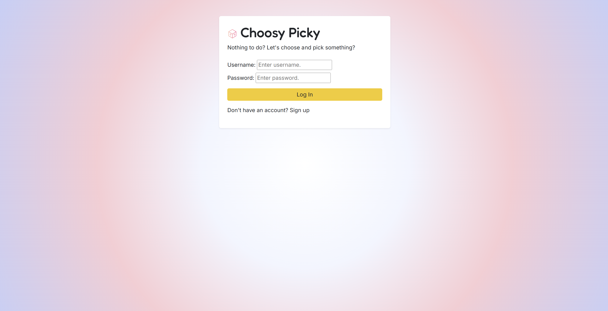
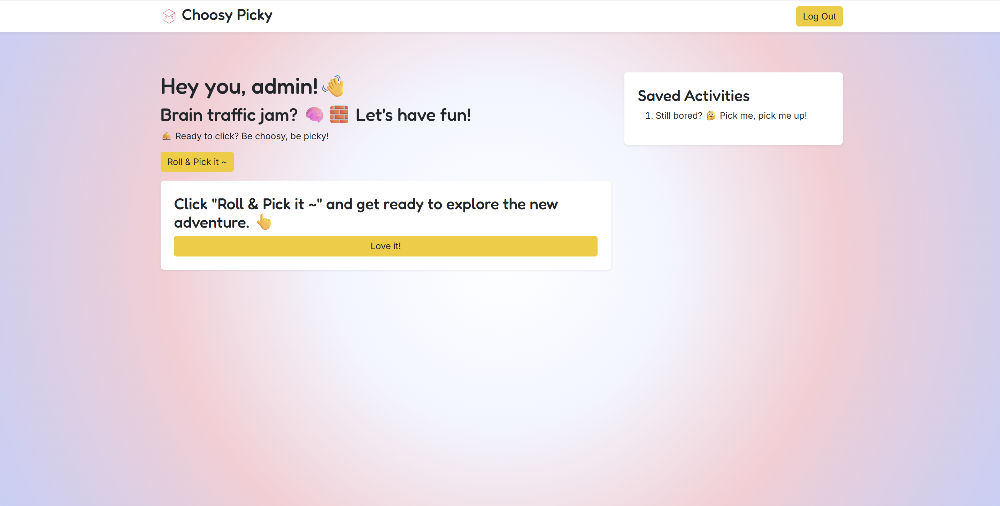

# Activity-Discovery-Dashboard

[Edit in StackBlitz next generation editor ⚡️](https://stackblitz.com/~/github.com/och-stack/Activity-Discovery-Dashboard)

🎲 Choosy Picky

Nothing to do? Let's choose and pick something?

Choosy Picky is an interactive activity discovery dashboard built with HTML, CSS and JavaScript. Users can log in, generate a random activity, view activity details, and save activities to their personal list.

Image 1: This is the image for login authenticator page.

Image 2: This is the image for the dashboard.

## Features
- User authentication with Login and Sign Up
- Login and Sign Up interface toggle
- Random activity discovery through API integration
- Activity details
- Save and remove activities
- Saved activity management
- User welcome message
- Logout functionality
- Input and error feedback
- Responsive dashboard interface

## Built with
- HTML
- CSS
- JavaScript
- Bootstrap
- Fetch API
- JSON
- DOM

> Admin login account (Testing Purpose):
>- Username: admin
>- Password: rando@123

